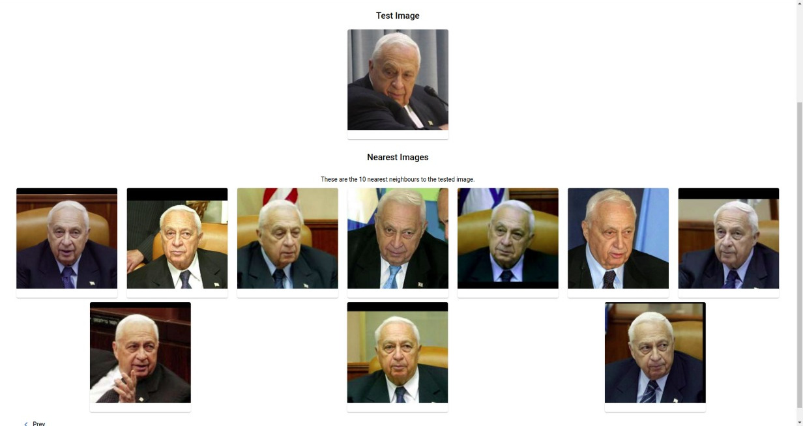

# PC 4: Database Multimedia

## Table of Contents

- [PC 4: Database Multimedia](#pc-4-database-multimedia)
  - [Table of Contents](#table-of-contents)
  - [Requirements](#requirements)
  - [Group members](#group-members)
- [Implementation](#implementation)
  - [Backend](#backend)
    - [Features Extraction](#features-extraction)
    - [Indexing and Searching](#indexing-and-searching)
      - [Sequential KNN with Priority Queue (without index)](#sequential-knn-with-priority-queue-without-index)
      - [Experiment 1](#experiment-1)
      - [R-Tree Multidimensional index](#r-tree-multidimensional-index)
      - [Experiment 2](#experiment-2)
  - [Frontend](#frontend)
  - [Galery](#galery)

---

This repo is for the PC4 of Data Base II course at UTEC

The project has frontend and backend part.

In [fronted](front-end) you can find the instructions to run the frontend in its README.md

In [backend](back-end) you can find the instructions to run the backend in its README.md

The project has the following architecture:

## Requirements

- [NodeJS](https://nodejs.org/es/)
- [Angular 9 or greater](https://angular.io/)
- [Python3](https://www.python.org/download/releases/3.0/)
- [OpenCV](https://opencv.org/)
- [dlib](https://pypi.org/project/dlib/)

## Group members

- Roosevelt Ubaldo
- Carlos Cupe
- José García

# Implementation

## Backend

### Features Extraction

First, of the 5749 classes, only 1683 were taken, which were the characters that had more than one photo.

Next, 75% of the photos per participant were separated for the analysis and the remaining 25% for the tests.

Finally, 128 features per image were extracted from the data for analysis using the face_recognition library. This information was saved together with the class to which it belongs in a binary file to reduce its size. In total 6187 images were analyzed.

It should be noted that 23 images were discarded, since the face was not detected.

### Indexing and Searching

#### Sequential KNN with Priority Queue (without index)

The **KNN Sequential** function receives the path of the image to be analyzed, the k neighbors and the distance function.

First, the features of the image to be evaluated are extracted.

After iterating over the binaries with the features of the images to calculate the distance between the two images, these values ​​are stored in a priority queue.

Lastly, the first k elements of the priority queue are returned.

#### Experiment 1

| Precision |  ED   |  MD   |
| :-------: | :---: | :---: |
|   K = 4   |  1.0  |  1.0  |
|   K = 8   |  1.0  |  1.0  |
|  K = 18   |  0.88 |  1.0  |

#### R-Tree Multidimensional index

#### Experiment 2

|  Tiempo   | KNN-RTree | KNN-Sequential |
| :-------: | :-------: | :------------: |
|  N = 100  |   0.167   |      0.194     |
|  N = 200  |   0.170   |      0.198     |
|  N = 400  |   0.181   |      0.215     |
|  N = 800  |   0.191   |      0.259     |
| N = 1600  |   0.189   |      0.334     |
| N = 3200  |   0.236   |      0.492     |
| N = 6187  |   0.319   |      0.855     |

## Frontend

The frontend was developed in **Angular 9** with Material Design components using **Material Angular** in components and services in a single default module.

The frontend has two principal pages, the home page and the search engine page. In the first one is a brief info of what the project is, while in the second one is the three steps to execute the query. In the first step we need to choose the type of search that we want to do. It could be a *KNN Search Without indexing* using *Manhattan* or *Euclidian Distance*, and *KNN Search Indexed* using an *R-Tree*. Then, in the second steep we need to upload the image to be tested. It could in `.jpg`, `.png` or `.gif` extension. Finally, in the third steep there is the results of our query and the tested image.

To communicate properly the backend and frontend an specific service (DataService) was create. In this service all the API calls was implemented (upload an image, execute KNN and execute KNN-Tree). Another service (MessageService) was created to uniformize all the status messages within all the pages in the webpage. In this way we can show the status of the API calls to the user and keep it informated of what is happening.

As we are using **Material Angular** the whole webpage is responsive and user-friendly.

## Galery

Here is some scheenshots of the webpage usage.

**Home page**

**Search engine**

As aforementioned we need to choose the type of searching algorithm and the number of *k* neighbours that we want to retrieve from the dataset.

Then, we need to upload the image to be tested.

**Results**
Finally, we are going to have the results of the query.

