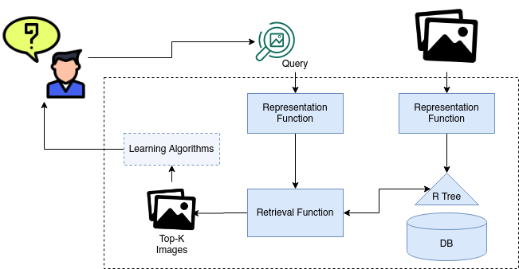
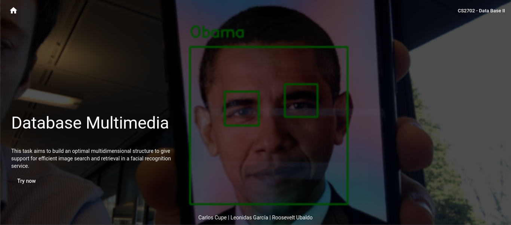
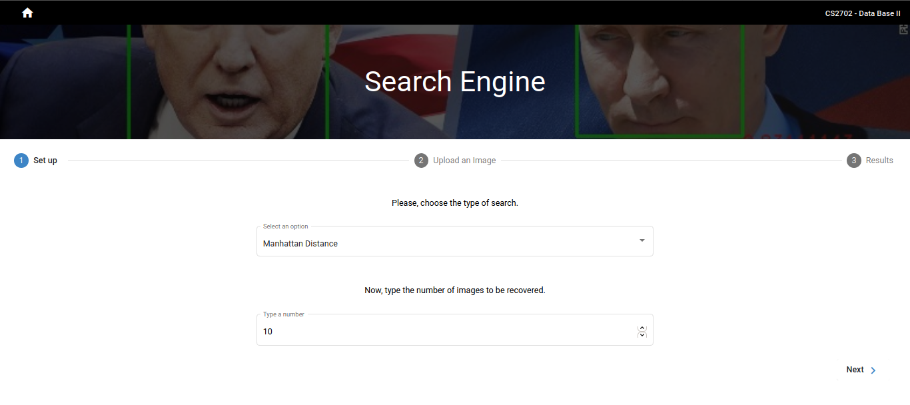
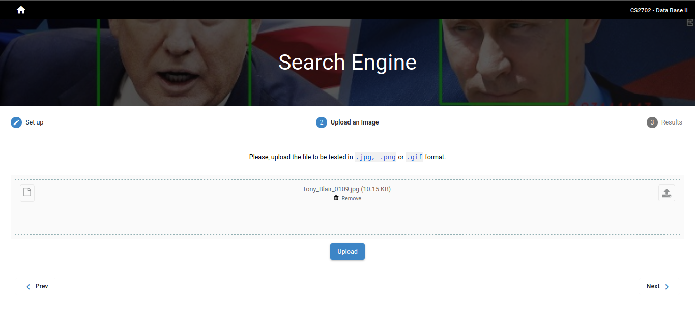

# PC 4: Database Multimedia

## Table of Contents

- [PC 4: Database Multimedia](#pc-4-database-multimedia)
  - [Table of Contents](#table-of-contents)
  - [Requirements](#requirements)
  - [Group members](#group-members)
- [Implementation](#implementation)
  - [Backend](#backend)
    - [Characteristics Extraction](#characteristics-extraction)
    - [Indexing and Searching](#indexing-and-searching)
      - [Sequential KNN with Priority Queue (without index)](#sequential-knn-with-priority-queue-without-index)
      - [Experiment 1](#experiment-1)
      - [R-Tree Multidimensional index](#r-tree-multidimensional-index)
      - [Experiment 2](#experiment-2)
  - [Frontend](#frontend)
  - [Galery](#galery)

---

This repo is for the PC4 of Data Base II course at UTEC

The project has frontend and backend part.

In [fronted](front-end) you can find the instructions to run the frontend in its README.md

In [backend](back-end) you can find the instructions to run the backend in its README.md

The project has the following architecture:

## Requirements

- [NodeJS](https://nodejs.org/es/)
- [Angular 9 or greater](https://angular.io/)
- [Python3](https://www.python.org/download/releases/3.0/)
- [OpenCV](https://opencv.org/)
- [dlib](https://pypi.org/project/dlib/)

## Group members

- Roosevelt Ubaldo
- Carlos Cupe
- José García

# Implementation

## Backend

### Characteristics Extraction

### Indexing and Searching

#### Sequential KNN with Priority Queue (without index)

#### Experiment 1

| Precision |  ED   |  MD   |
| :-------: | :---: | :---: |
|   K = 4   |       |       |
|   K = 8   |       |       |
|  K = 16   |       |       |

#### R-Tree Multidimensional index

#### Experiment 2

|  Tiempo   | KNN-RTree | KNN-Sequential |
| :-------: | :-------: | :------------: |
|  N = 100  |           |                |
|  N = 200  |           |                |
|  N = 400  |           |                |
|  N = 800  |           |                |
| N = 1600  |           |                |
| N = 3200  |           |                |
| N = 6400  |           |                |
| N = 12800 |           |                |

## Frontend

## Galery

**Home page**

**Search engine**

